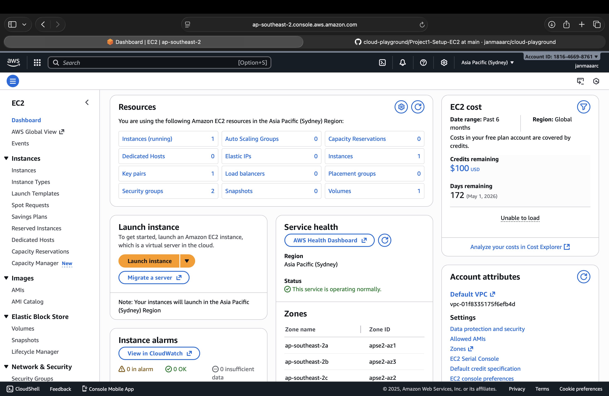
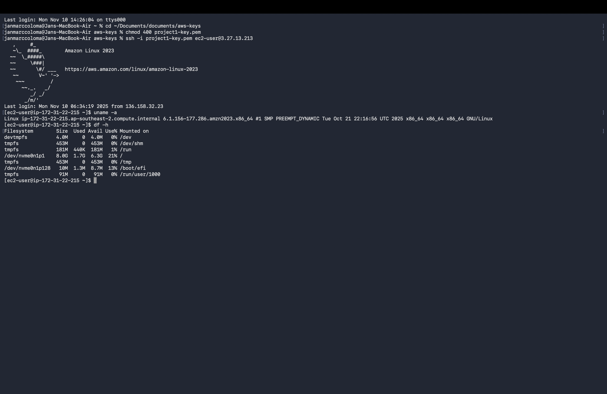
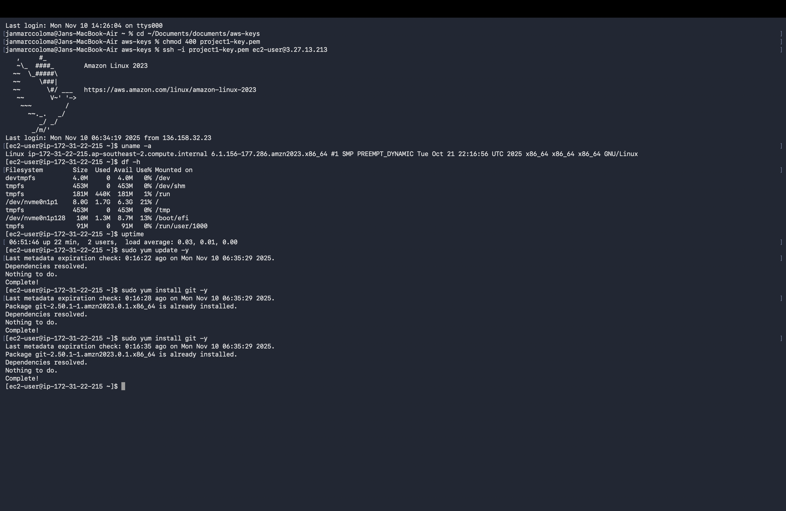

# Project 1 – AWS Setup & EC2 Launch

## Objectives
- Create AWS Free Tier account and enable MFA
- Launch an EC2 t3.micro instance
- Connect via SSH from MacBook terminal
- Verify the instance and run basic Linux commands
- Document setup steps, commands, and lessons learned

---

## Steps

### 1. AWS Account Setup
- Created AWS Free Tier account.
- Enabled Multi-Factor Authentication (MFA) for enhanced security.
- Noted AWS account ID and default region (e.g., `us-east-1`).

### 2. Launch EC2 Instance
- Selected **Amazon Linux 2 AMI**.
- Chose **t3.micro** (Free Tier eligible).
- Configured default VPC and subnet.
- Added tag: `Name: Project1-EC2`.
- Created security group to allow SSH (port 22) from my IP.
- Created and downloaded `.pem` key: `project1-key.pem`.

### 3. Connect to EC2 via SSH (MacBook)
```bash
# Navigate to key folder
cd ~/Documents/documents/aws-keys

# Secure the key
chmod 400 project1-key.pem

# Connect to EC2 instance
ssh -i project1-key.pem ec2-user@3.27.13.213
```

### 4. Verify Instance
```bash
# Check OS info
uname -a

# Check disk usage
df -h

# Check uptime
uptime

# Update packages
sudo yum update -y

# Install Git
sudo yum install git -y
```
---

## Commands Used
```
cd ~/Documents/documents/aws-keys
chmod 400 project1-key.pem
ssh -i project1-key.pem ec2-user@3.27.13.213
uname -a
df -h
uptime
sudo yum update -y
sudo yum install git -y
```
---
## Notes / Lessons Learned
- Launching an EC2 instance on AWS Free Tier is straightforward and beginner-friendly.
- SSH connection requires the `.pem` key to have proper permissions (`chmod 400`).
- Security group must allow your current IP for port 22 to enable SSH access.
- Basic Linux commands (`uname -a`, `df -h`, `uptime`) are useful to verify instance health and configuration.
- Always update the instance (`sudo yum update -y`) before installing additional packages.
- Installing Git (`sudo yum install git -y`) prepares the instance for future cloud projects.
- Documenting each step and taking screenshots makes troubleshooting easier and ensures reproducibility.
- AWS Free Tier limits should be monitored to avoid unexpected charges.

---

## Screenshots

### EC2 Dashboard


### SSH Terminal Connection


### Linux Commands Output

