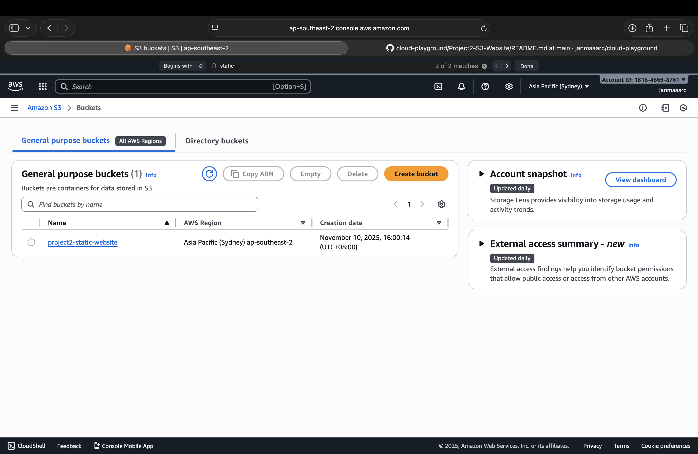
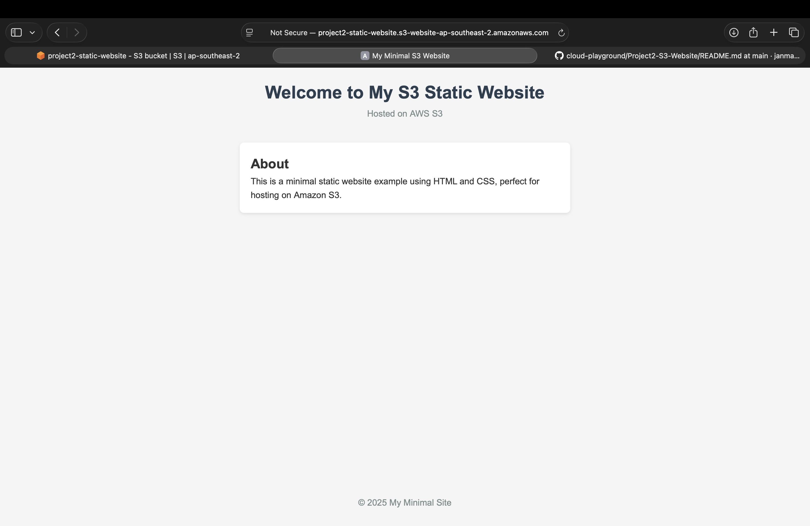

# Project 2 – S3 Static Website Hosting

## Objectives
- Create an S3 bucket and enable static website hosting
- Upload HTML/CSS files to the bucket
- Configure bucket permissions for public access
- Test and view the live website
- Document steps, commands, and lessons learned

---

## Steps

### 1. Create S3 Bucket
- Log in to AWS console.
- Navigate to **S3** service.
- Create a new bucket (e.g., `project2-static-site`).
- Enable **Static Website Hosting**.
- Configure bucket permissions for public read access.

### 2. Upload Website Files
- Prepare HTML/CSS files locally.
- Upload files to the S3 bucket.
- Set the `index.html` as the default root document.

### 3. Access Website
- Copy the **S3 website endpoint URL**.
- Open in browser to verify the site is live.

---

## Commands / AWS CLI (Optional)
```bash
# Example: Create bucket via AWS CLI
aws s3 mb s3://project2-static-site

# Sync local folder to S3 bucket
aws s3 sync ./local-website-folder s3://project2-static-site --acl public-read
```
---

## Notes / Lessons Learned
- S3 buckets need unique names across AWS.
- Public access settings are required to host a static website.
- The bucket region affects the website endpoint URL.
- Using `aws s3 sync` makes uploading multiple files easier.
- Always test the live URL to ensure website files are loading correctly.

---

## Screenshots

### S3 Bucket Dashboard


### Live Website

