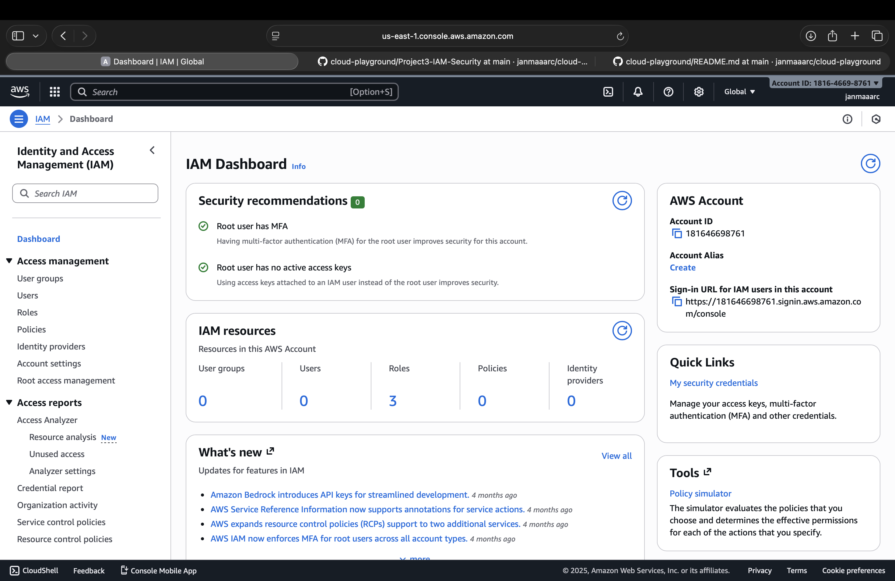
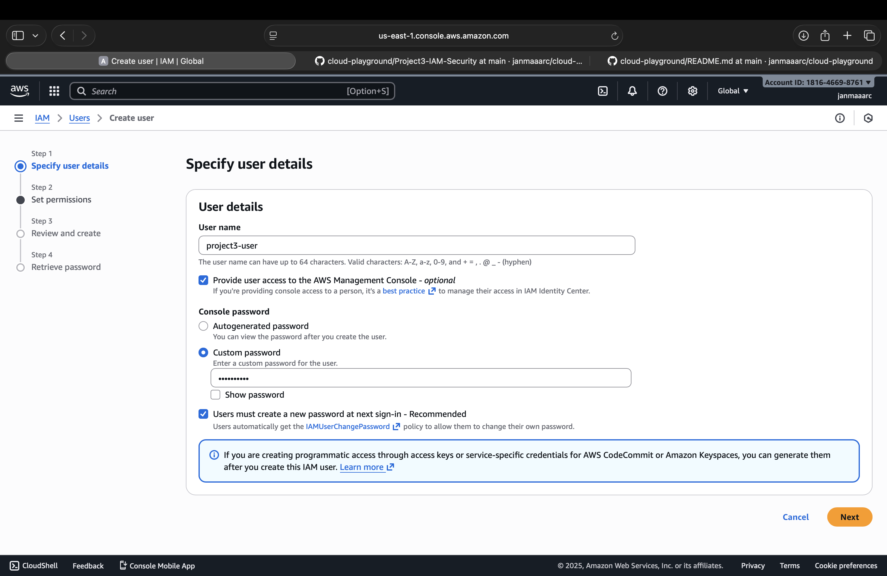
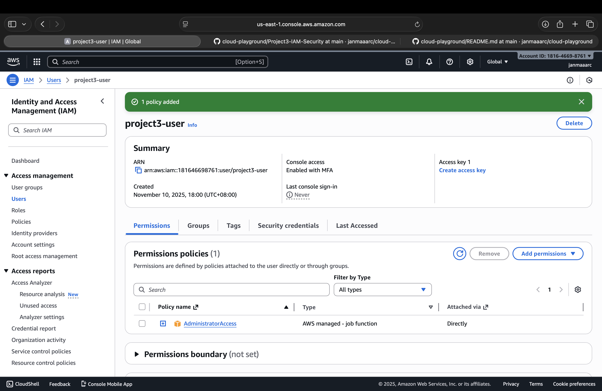

# Project 3 – IAM & Security

## Objectives
- Understand AWS Identity and Access Management (IAM)
- Create IAM users with specific permissions
- Apply IAM policies for least privilege
- Enable MFA for enhanced account security
- Document steps, commands, and lessons learned

---

## Steps

### 1. Access IAM Console
- Log in to AWS Console → Navigate to **IAM** service.
- Review the IAM Dashboard and existing users, roles, and policies.

### 2. Create IAM User
- Click **Users → Add User**.
- Provide a username (e.g., `project3-user`).
- Select **Programmatic access** and/or **AWS Management Console access**.
- Set a temporary password if console access is selected.

### 3. Assign Permissions
- Choose **Attach existing policies directly**.
- Select **AdministratorAccess** (for learning) or **custom policies** for least privilege.
- Review and create user.

### 4. Enable MFA
- Navigate to the newly created user → **Security credentials**.
- Enable **MFA (Virtual MFA)** for extra security.

---

## Commands / AWS CLI (Optional)
```bash
# List IAM users
aws iam list-users

# Create IAM user
aws iam create-user --user-name project3-user

# Attach policy to user
aws iam attach-user-policy --user-name project3-user --policy-arn arn:aws:iam::aws:policy/AdministratorAccess
```

---

## Notes / Lessons Learned

- IAM allows precise control of AWS access and privileges.
- Always follow least privilege principle: give only required permissions.
- MFA adds an essential security layer for all accounts.
- Proper documentation and tagging of IAM users helps manage multiple accounts.
- Testing IAM policies ensures users can access only what’s needed.

---

## Screenshots

### IAM Dashboard


### Create IAM User


### Permission Policy

