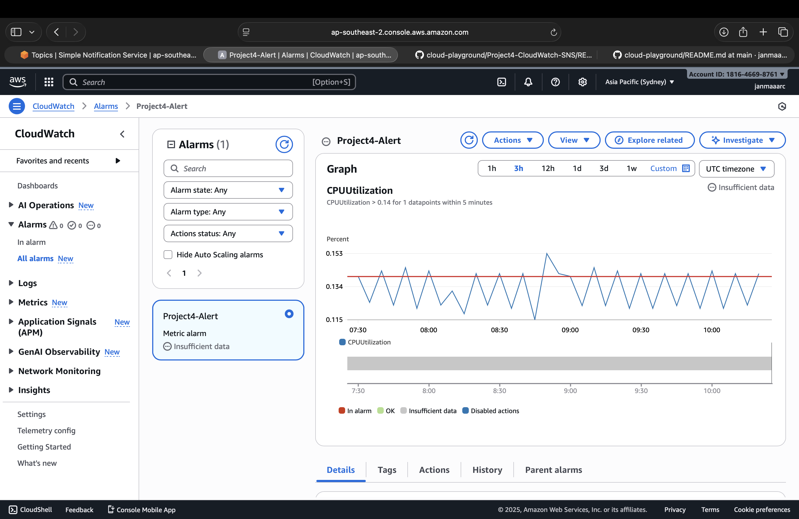
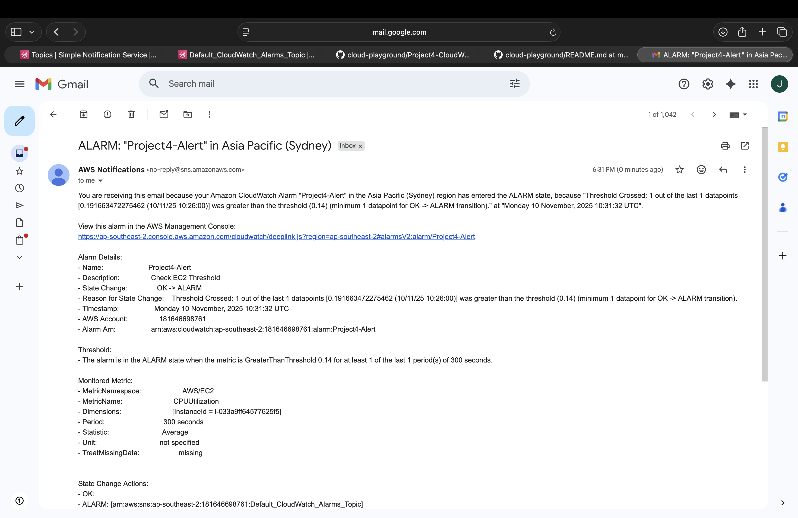

# Project 4 – CloudWatch & SNS Notifications

## Objectives
- Monitor AWS resources using CloudWatch
- Create alarms based on metrics (CPU, memory, etc.)
- Send notifications via SNS when thresholds are breached
- Document steps, commands, and lessons learned

---

## Steps

### 1. Access CloudWatch
- Log in to AWS Console → Navigate to **CloudWatch**.
- Review dashboards and available metrics.

### 2. Create Alarm
- Select a metric (e.g., CPU Utilization for EC2 instance).
- Click **Create Alarm**.
- Set threshold and evaluation period.
- Choose actions → **Send notification**.

### 3. Configure SNS
- Navigate to **SNS** → Create a topic (e.g., `Project4-Alerts`).
- Subscribe an email address or endpoint.
- Link SNS topic to the CloudWatch alarm.

### 4. Test Notifications
- Trigger alarm conditions (or use test feature).
- Verify that notifications are received.

---

## Commands / AWS CLI (Optional)
```bash
# List CloudWatch alarms
aws cloudwatch describe-alarms

# Create SNS topic
aws sns create-topic --name Project4-Alerts

# Subscribe email to SNS topic
aws sns subscribe --topic-arn arn:aws:sns:us-east-1:123456789012:Project4-Alerts --protocol email --notification-endpoint your-email@example.com
```

---

## Notes / Lessons Learned

- CloudWatch provides real-time monitoring for AWS resources.
- Alarms help automate responses to resource issues.
- SNS allows flexible notification options (email, SMS, Lambda, HTTP endpoint).
- Testing notifications ensures alerts are configured correctly.
- Documenting steps ensures reproducibility and easier troubleshooting.

---

## Screenshots

### CloudWatch Dashboard


### Create IAM User


### SNS Notification

