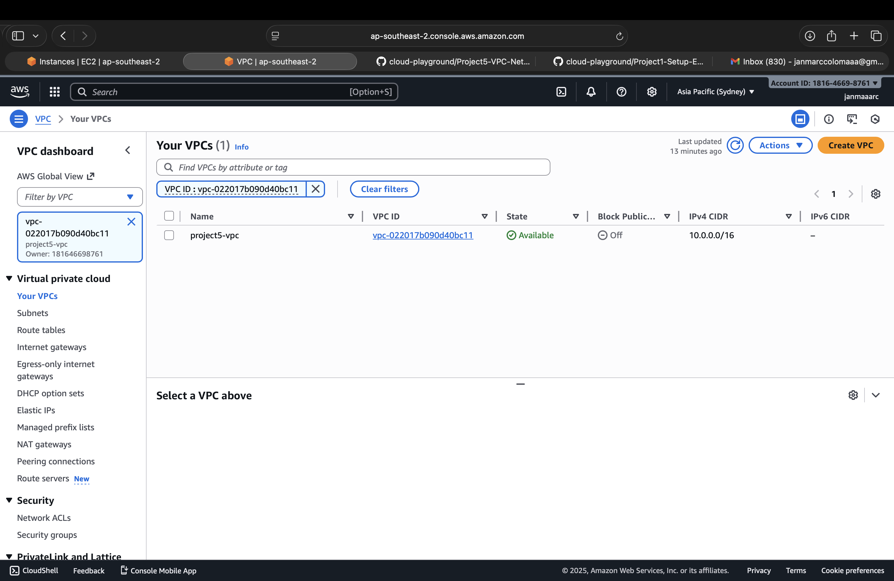
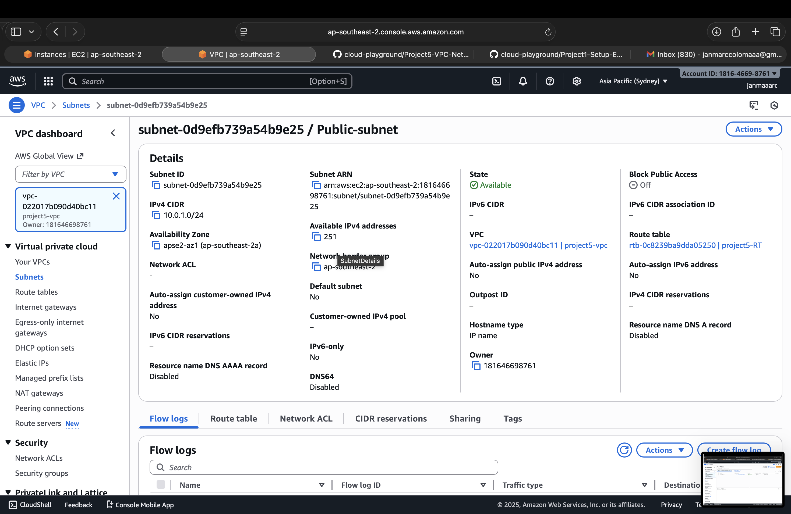

# Project 5 – VPC & Networking

## Objectives
- Create Virtual Private Cloud (VPC) with public and private subnets
- Configure security groups and Network ACLs (NACLs)
- Launch EC2 instances in different subnets
- Document network setup and architecture
- Include screenshots and notes

---

## Steps

### 1. Create VPC
- Navigate to **VPC** service in AWS Console.
- Click **Create VPC** → provide name, CIDR block (e.g., 10.0.0.0/16).

### 2. Create Subnets
- Create **Public Subnet** (e.g., 10.0.1.0/24)
- Create **Private Subnet** (e.g., 10.0.2.0/24)
- Assign subnets to appropriate availability zones.

### 3. Configure Internet Gateway
- Create **Internet Gateway** and attach it to your VPC.
- Update route table for public subnet → add route to IGW.

### 4. Configure Security Groups
- Create security group for EC2 instances in public subnet (allow SSH, HTTP).
- Create security group for private subnet instances (allow only internal traffic).

### 5. Network ACLs (Optional)
- Create NACLs for public/private subnets.
- Configure inbound/outbound rules for added security.

### 6. Launch EC2 Instances
- Launch EC2 instances in both public and private subnets.
- Test connectivity (SSH to public, internal communication to private).

---

## Commands / AWS CLI (Optional)
```bash
# Describe VPCs
aws ec2 describe-vpcs

# Create subnet
aws ec2 create-subnet --vpc-id vpc-xxxxxxxx --cidr-block 10.0.1.0/24

# Create security group
aws ec2 create-security-group --group-name PublicSG --description "Public subnet SG" --vpc-id vpc-xxxxxxxx
```

---

## Notes / Lessons Learned

- Proper subnet planning ensures secure and scalable networks.
- Security groups act as virtual firewalls for instances.
- NACLs provide an additional layer of control at the subnet level.
- Documenting VPC setup helps with troubleshooting and future expansion.
- Testing connectivity confirms correct routing and access control.

---

## Screenshots

### VPC Dashboard


### Public Subnet


### Private Subnet

