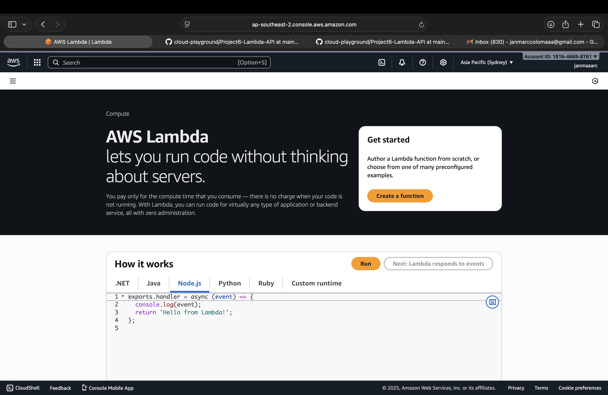
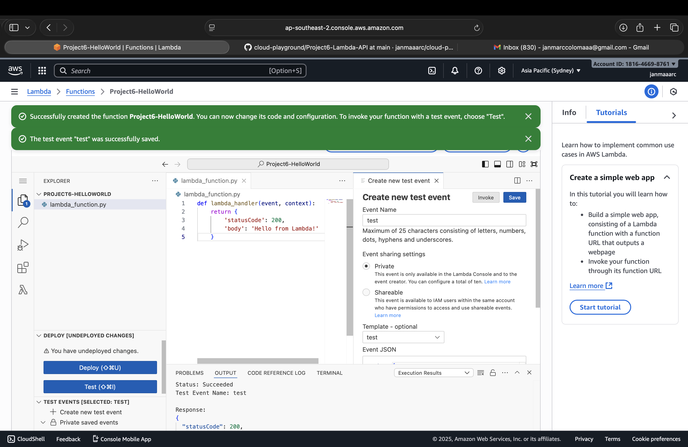

# Project 6 – Lambda & API Gateway

## Objectives
- Create AWS Lambda functions for serverless computing
- Trigger Lambda using AWS API Gateway
- Test API endpoints
- Document setup, commands, and lessons learned
- Include screenshots

---

## Steps

### 1. Create Lambda Function
- Navigate to **Lambda** in AWS Console.
- Click **Create Function** → Author from scratch.
- Provide function name (e.g., `Project6-HelloWorld`).
- Choose runtime (e.g., Python 3.11 or Node.js 20.x).
- Create or assign an execution role with required permissions.

### 2. Add Function Code
Write basic code to handle requests:
```python
def lambda_handler(event, context):
    return {
        'statusCode': 200,
        'body': 'Hello from Lambda!'
    }
```
Save and test function using the Lambda console.

### 3. Test Lambda Using AWS CLI (Recommended)
Invoke Lambda directly from terminal:
```bash
aws lambda invoke --function-name Project6-HelloWorld response.json
cat response.json
```
Expected output:
 ```json
"Hello from Lambda!"
```
> Note: This method avoids DNS or network issues that may prevent curl from reaching the API Gateway endpoint.

### 4. Create API Gateway (Optional)
- Navigate to API Gateway → Create API → HTTP API.
- Add integration → select the Lambda function created.
- Deploy API to a stage (e.g., dev).

### 5. Test API Gateway Endpoint (Optional)
- Copy the API endpoint URL.
- Example GET request:
```bash
curl "https://1eh7xgu2b5.execute-api.ap-southeast-2.amazonaws.com/dev/hello"
```
>Caution: On some networks or DNS configurations, curl may fail to resolve the API Gateway domain. If this occurs, use the AWS CLI direct invocation method above.

---

## Commands / AWS CLI (Optional)
```bash
# List Lambda functions
aws lambda list-functions

# Invoke Lambda function
aws lambda invoke --function-name Project6-HelloWorld response.json

# Deploy API using CLI (example)
aws apigateway create-deployment --rest-api-id xxxxx --stage-name dev
```

---

## Notes / Lessons Learned

- Lambda enables serverless execution without managing servers.
- AWS CLI invocation is reliable for testing Lambda, especially when DNS issues occur.
- API Gateway allows external clients to call Lambda functions over HTTP.
- Proper IAM role assignment is crucial for Lambda execution.
- Documenting each step ensures reproducibility for future serverless projects.

---

## Screenshots

### Lambda Dashboard


### Create Lambda Function


### API Gateway Test

