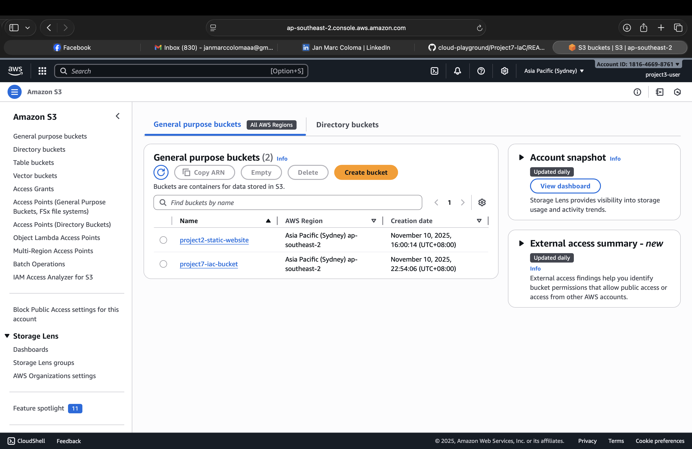

# Project 7 – Infrastructure as Code (IaC)

## Objectives
-	Automate cloud resource deployment using Infrastructure as Code (IaC)
-	Use Terraform (or AWS CloudFormation) for provisioning
-	Manage and version infrastructure consistently
-	Deploy and verify resources such as EC2 instances and S3 buckets
-	Document setup, commands, lessons learned, and include screenshots

---

## Steps


### 1. Choose IaC Tool
- Decide between **Terraform** or **CloudFormation**.
- Terraform was used for this project.
- Install necessary CLI:
  - Terraform: `brew install terraform`
  - CloudFormation: `brew install awscli`
 
### 2. Configure AWS Credentials
```bash
aws configure
```
#### Input your Access Key ID, Secret Access Key, Region (ap-southeast-2), and output format (json).

### 3. Write IaC Configuration

#### **Example: Terraform (main.tf)**
```hcl
provider "aws" {
  region = "ap-southeast-2"
}

resource "aws_s3_bucket" "my_bucket" {
  bucket = "project7-iac-bucket"
}

resource "aws_instance" "my_ec2" {
  ami           = "ami-0b0dcb5067f052a63" # replace with valid AMI in your region
  instance_type = "t3.micro"
  tags = {
    Name = "Project7-IaC-EC2"
  }
}
```
> Note: Make sure to use an available AMI in your AWS region. You can find it via the console or AWS CLI:
```bash
aws ec2 describe-images --owners amazon --filters "Name=name,Values=amzn2-ami-hvm-2.0.*-x86_64-gp2" --region ap-southeast-2
```


#### **Example: CloudFormation (template.yaml)**
```yaml
Resources:
  MyS3Bucket:
    Type: AWS::S3::Bucket
    Properties:
      BucketName: project7-iac-bucket

  MyEC2Instance:
    Type: AWS::EC2::Instance
    Properties:
      InstanceType: t3.micro
      ImageId: ami-0abcdef1234567890
      Tags:
        - Key: Name
          Value: Project7-IaC-EC2
```

### 4. Deploy Infrastructure
Terraform
```bash
# Initialize working directory
terraform init

# Preview changes
terraform plan

# Deploy resources
terraform apply
```
#### Type yes to confirm.


Cloudformation
```bash
aws cloudformation deploy \
  --template-file template.yaml \
  --stack-name Project7-IaC \
  --capabilities CAPABILITY_NAMED_IAM
```

### 5. Verify Resources
- Check AWS Console for:
  - S3 Bucket: project7-iac-bucket
  - EC2 Instance: Project7-IaC-EC2, check instance ID and public IP.
- Test connectivity to EC2 if SSH key configured.

---

## Commands / AWS CLI (Optional)
```bash
# List S3 buckets
aws s3 ls

# Describe EC2 instance
aws ec2 describe-instances --instance-ids <instance-id> --region ap-southeast-2

# Terraform
terraform show
terraform destroy

# CloudFormation
aws cloudformation describe-stacks --stack-name Project7-IaC
aws cloudformation delete-stack --stack-name Project7-IaC
```

---

## Notes / Lessons Learned

- IaC ensures repeatable, automated deployments and reduces manual errors.
- Terraform supports multiple cloud providers; CloudFormation is AWS-specific.
- Always check AMI availability in your chosen region to avoid deployment errors.
- Tagging and naming resources properly makes infrastructure easier to manage.
- Verifying resources after deployment confirms the correctness of your IaC configuration.

---

## Screenshots

### Terraform Deployment Overview


### EC2 Instance Created


### S3 Bucket Created

